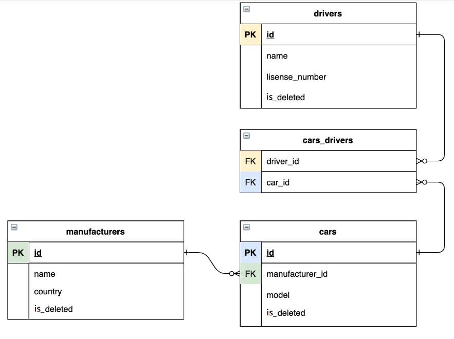

# Taxi-service
### Project description
> Taxi service is an application that was created following SOLID principles, using such a pattern 
> as Dependency injection or rather his form Inversion of Control.This application supports 
> authentication and CRUD operations.
------------
## CONTENT

* <a href="#features">Features</a> 
* <a href="#project_structure">Project structure</a> 
* <a href="#technologies">Technologies</a> 
* <a href="#instructions">Instructions</a> 

## Features
* Register driver
* Authenticate driver
* Show the driver’s current car that belongs to him
* Create/update/delete driver from DB
* Create/update/delete manufacturer from DB
* Create/update/delete car from DB
* Display list of drivers from DB
* Display list of cars from DB
* Display list of manufacturers from DB
---------

## Technologies
* ***Java 11***
* ***MAVEN 4.0.0***
* ***MYSQL 8.0.28***
* ***JDBC***
* ***SERVLET 4.0.1***
* ***JSP***
* ***JSTL 1.2***
* ***HTML***
* ***CSS***
* ***TOMCAT 9.0.50***
--------
## Structure
>This application uses in their structure N-tier architecture

| Layer                      | Responsibilities                                                                                                                                                        |
|:---------------------------|:------------------------------------------------------------------------------------------------------------------------------------------------------------------------|
| **The presentation layer** | ***(Controllers)*** is presented by JSP pages and Servlet interfaces. This layer is responsible for interacting with users. Users can send requests and get a response  |
| **Logic layer**            | ***(Services)*** this layer is responsible for performing data processing of an application                                                                             |
| **Data layer**             | ***(Dao)*** This layer is responsible for getting a connection with the database, and performing CRUD operations. Here we use JDBC API                                  |

----------------------
**UML Diagram**

--------

**DB Diagram**

------------
## Instructions
* Clone repository [here](https://github.com/Nikitos787/my-taxi-service.git)
* Install MySQL
* Install and Configure **TOMCAT 9.0.50**
* Copy SQL [script](src/main/resources/init_db.sql) for creating schema and table in the database
* Configure Connection to database
  * Insert your own MySQL username and login in dbProperties in the [ConnectionUtil](src/main/java/taxi/util/ConnectionUtil.java) class.
  * Setup new connection with:
    * user: ***"your username"***
    * password: ***"your password"***
    * url: *jdbc:mysql://localhost:3306/taxi?useLegacyDatetimeCode=false&serverTimezone=UTC*
    * JDBC Driver: **com.mysql.cj.jdbc.Driver**
* Run a project
